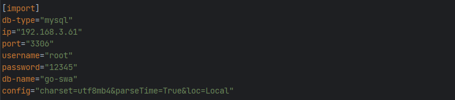
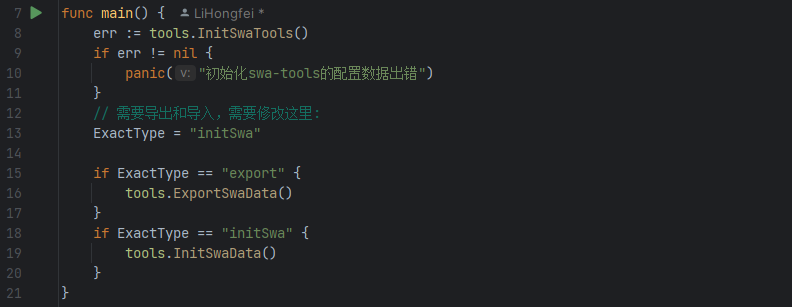

# swa-tools
<<<<<<< HEAD
 swa-tools
=======

### 介绍
```
go-swa数据库初始化工具。
```
### 注意事项
```
当前此工具的版本号为： v4.1.16
！！！此工具版本必与go-swa的版本号保持一致，避免导入的数据有错！！！！
```
### 功能：
```
1. 导出数据仓库的系统数据表
2. 导入数据仓库的系统数据表
```
### 安装教程
```
1.  具备golang环境
2.  使用gland或是vscode打开
3.  导入引用模块
```
```shell
go mod tidy
```
### 使用说明
```
1.  前提： 
    1.数据库表go-swa已经创建,但表内容为空
    2.go-swa已经成功运行,并已经自动创建go-swa下的系统表
2.  注意：如果系统数据表已有数据，表中ID相同数据不会被覆盖。
3.  修改配置文件[import]的内容为实际开发环境配置
```

```
4.  修改main.go文件中第13行为： ExactType = "initSwa"
5.  运行main文件,即可导入基础数据
```

>>>>>>> c98342c (readme)
